[](https://classroom.github.com/a/SdXSjEmH)
# EV-HW3: PhysGaussian

This homework is based on the recent CVPR 2024 paper [PhysGaussian](https://github.com/XPandora/PhysGaussian/tree/main), which introduces a novel framework that integrates physical constraints into 3D Gaussian representations for modeling generative dynamics.

You are **not required** to implement training from scratch. Instead, your task is to set up the environment as specified in the official repository and run the simulation scripts to observe and analyze the results.


## Getting the Code from the Official PhysGaussian GitHub Repository
Download the official codebase using the following command:
```
git clone https://github.com/XPandora/PhysGaussian.git
```


## Environment Setup
Navigate to the "PhysGaussian" directory and follow the instructions under the "Python Environment" section in the official README to set up the environment.


## Running the Simulation
Follow the "Quick Start" section and execute the simulation scripts as instructed. Make sure to verify your outputs and understand the role of physics constraints in the generated dynamics.


## Homework Instructions
Please complete Part 1–2 as described in the [Google Slides](https://docs.google.com/presentation/d/13JcQC12pI8Wb9ZuaVV400HVZr9eUeZvf7gB7Le8FRV4/edit?usp=sharing).


## Part 1 – PhysGaussian Baseline

### material

| jelly | sand |
|-------|------|
| <video src="https://github.com/user-attachments/assets/1eb75164-623b-4b46-9b7b-ed5f86889607" width="320" autoplay muted loop playsinline controls></video> | <video src="https://github.com/user-attachments/assets/9e393556-fe18-40db-98ce-88528893b032" width="320" autoplay muted loop playsinline controls></video> |
| [Video Link](https://youtube.com/shorts/4eTmgrpqxUo) | [Video Link](https://youtube.com/shorts/zH90wdfTkIA) |


## Part 2 – Exploring MPM Parameter Effects


### 1. `n_grid`

#### jelly (`pillow2sofa_config.json`)

| 50                                                                                                                                                         | 100 (baseline)                                                                                                                                             | 200                                                                                                                                                        |
| ---------------------------------------------------------------------------------------------------------------------------------------------------------- | ---------------------------------------------------------------------------------------------------------------------------------------------------------- | ---------------------------------------------------------------------------------------------------------------------------------------------------------- |
| <video src="https://github.com/user-attachments/assets/0476efbb-2980-4a95-9447-d7e5064baed4" width="320" autoplay muted loop playsinline controls></video> | <video src="https://github.com/user-attachments/assets/1eb75164-623b-4b46-9b7b-ed5f86889607" width="320" autoplay muted loop playsinline controls></video> | <video src="https://github.com/user-attachments/assets/9ee21096-fc02-49d4-a692-ac6aabe853cd" width="320" autoplay muted loop playsinline controls></video> |

* PSNR

  * 100 vs 50
    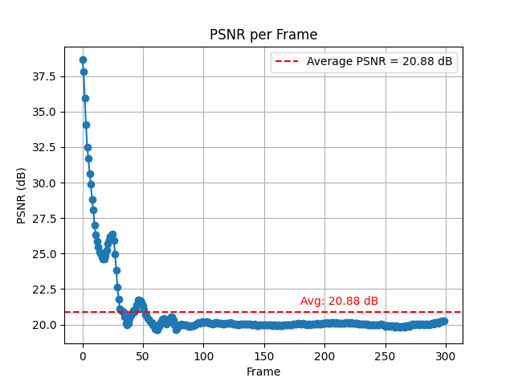
  * 100 vs 200
    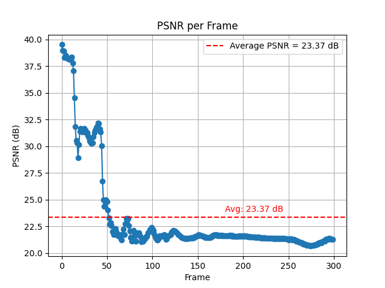

#### sand (`wolf_config.json`)

| 50                                                                                                                                                         | 200 (baseline)                                                                                                                                             | 300                                                                                                                                                        |
| ---------------------------------------------------------------------------------------------------------------------------------------------------------- | ---------------------------------------------------------------------------------------------------------------------------------------------------------- | ---------------------------------------------------------------------------------------------------------------------------------------------------------- |
| <video src="https://github.com/user-attachments/assets/4a661f9f-c9d8-4bed-a404-1aba95358d38" width="320" autoplay muted loop playsinline controls></video> | <video src="https://github.com/user-attachments/assets/9e393556-fe18-40db-98ce-88528893b032" width="320" autoplay muted loop playsinline controls></video> | <video src="https://github.com/user-attachments/assets/0dcdbfe9-ad12-429b-9032-498d5718ba30" width="320" autoplay muted loop playsinline controls></video> |

* PSNR

  * 200 vs 50
    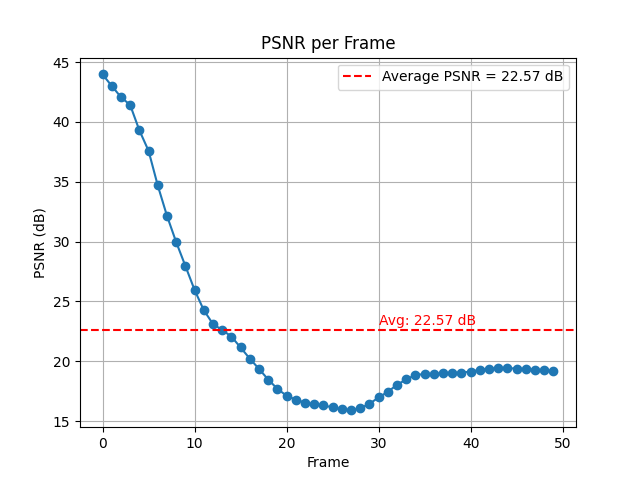
  * 200 vs 300
    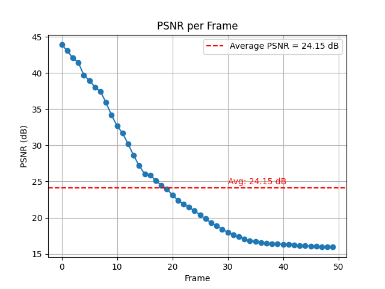

### observed

n_grid represents the discretization level of the simulation space. A larger value results in finer grids and higher simulation accuracy. The simulation videos show that increasing n_grid generally enhances the details and accuracy of the simulation, and PSNR improves. However, computational cost also increases. A too-small n_grid may lead to loss of details or numerical dissipation.


---

### 2. `substep_dt`

#### jelly

| 1e‑5                                                                                                                                                       | 1e‑4 (baseline)                                                                                                                                            | 5e‑3                                                                                                                                                       |
| ---------------------------------------------------------------------------------------------------------------------------------------------------------- | ---------------------------------------------------------------------------------------------------------------------------------------------------------- | ---------------------------------------------------------------------------------------------------------------------------------------------------------- |
| <video src="https://github.com/user-attachments/assets/e9aab728-6181-469c-b653-136fdd4aa1a3" width="320" autoplay muted loop playsinline controls></video> | <video src="https://github.com/user-attachments/assets/1eb75164-623b-4b46-9b7b-ed5f86889607" width="320" autoplay muted loop playsinline controls></video> | <video src="https://github.com/user-attachments/assets/42ff9dfb-b430-4f50-8d12-7ab81df2ab50" width="320" autoplay muted loop playsinline controls></video> |

* PSNR

  * 1e-4 vs 1e-5
    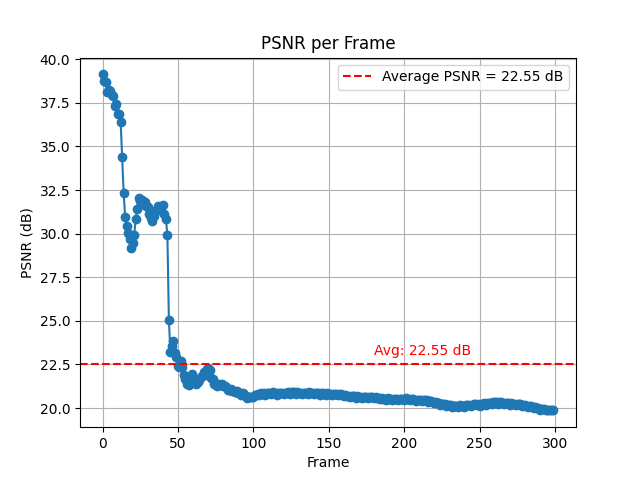
  * 1e-4 vs 5e-3
    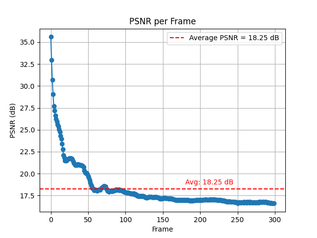

#### sand

| 1e‑6                                                                                                                                                       | 2e‑5 (baseline)                                                                                                                                            | 5e‑5                                                                                                                                                       |
| ---------------------------------------------------------------------------------------------------------------------------------------------------------- | ---------------------------------------------------------------------------------------------------------------------------------------------------------- | ---------------------------------------------------------------------------------------------------------------------------------------------------------- |
| <video src="https://github.com/user-attachments/assets/a8c57807-7738-44fa-82bb-e021a3b90e63" width="320" autoplay muted loop playsinline controls></video> | <video src="https://github.com/user-attachments/assets/9e393556-fe18-40db-98ce-88528893b032" width="320" autoplay muted loop playsinline controls></video> | <video src="https://github.com/user-attachments/assets/4851a018-110f-41b8-8dfa-45334f54a646" width="320" autoplay muted loop playsinline controls></video> |

* PSNR

  * 2e-5 vs 1e-6
    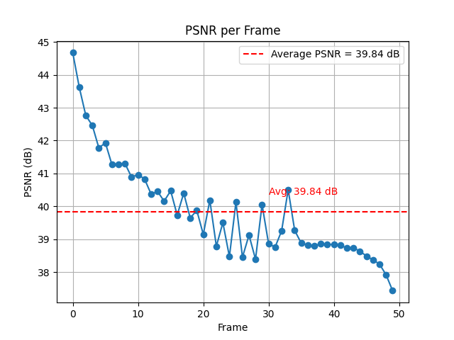
  * 2e-5 vs 5e-5
    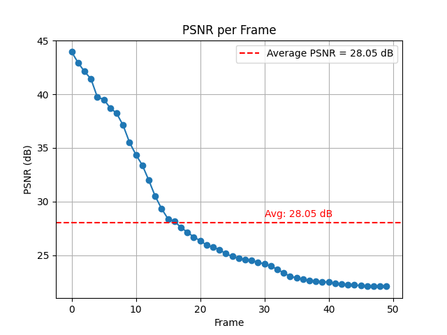

### observed

Reducing substep_dt (increasing substeps) results in more stable simulations, smoother particle motion, and improved PSNR, but increases computation time. Substeps determine the number of subdivisions within each simulation step. A higher value results in finer time integration, reducing numerical integration errors and improving stability and accuracy, with PSNR also improving. However, too many substeps increase computation time, while too few may lead to instability or distorted physical phenomena.

---

### 3. `grid_v_damping_scale`

#### jelly

| 0.995                                                                                                                                                      | 0.997                                                                                                                                                      | 1.1 (baseline)                                                                                                                                             |
| ---------------------------------------------------------------------------------------------------------------------------------------------------------- | ---------------------------------------------------------------------------------------------------------------------------------------------------------- | ---------------------------------------------------------------------------------------------------------------------------------------------------------- |
| <video src="https://github.com/user-attachments/assets/d0068618-b0a3-4dd9-a270-7d13a20bbe13" width="320" autoplay muted loop playsinline controls></video> | <video src="https://github.com/user-attachments/assets/d0a20968-e697-4b8e-aa0d-4770f6945f96" width="320" autoplay muted loop playsinline controls></video> | <video src="https://github.com/user-attachments/assets/1eb75164-623b-4b46-9b7b-ed5f86889607" width="320" autoplay muted loop playsinline controls></video> |

* PSNR

  * 1.1 vs 0.995
    
  * 1.1 vs 0.997
    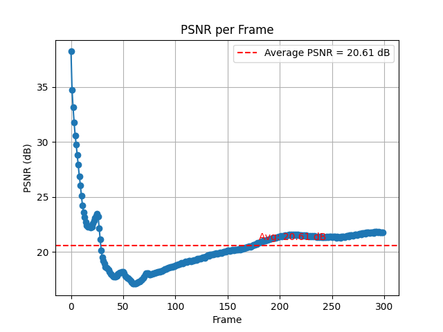

#### sand

| 0.995                                                                                                                                                      | 0.997                                                                                                                                                      | 1.1 (baseline)                                                                                                                                             |
| ---------------------------------------------------------------------------------------------------------------------------------------------------------- | ---------------------------------------------------------------------------------------------------------------------------------------------------------- | ---------------------------------------------------------------------------------------------------------------------------------------------------------- |
| <video src="https://github.com/user-attachments/assets/9409f4f2-02f8-4a8d-8be0-1552f4bea8bb" width="320" autoplay muted loop playsinline controls></video> | <video src="https://github.com/user-attachments/assets/77b22823-04df-43cc-90bd-66a000ce5e4d" width="320" autoplay muted loop playsinline controls></video> | <video src="https://github.com/user-attachments/assets/9e393556-fe18-40db-98ce-88528893b032" width="320" autoplay muted loop playsinline controls></video> |

* PSNR

  * 1.1 vs 0.995
    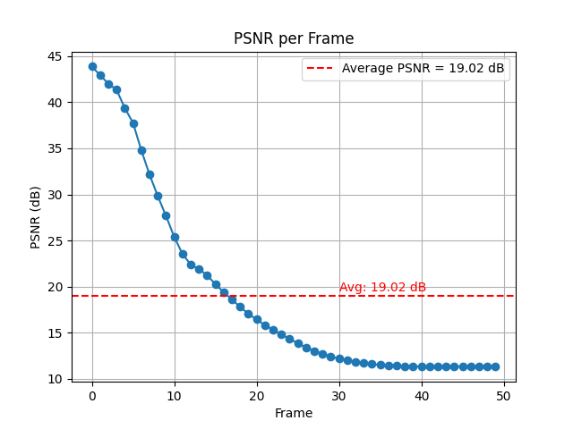
  * 1.1 vs 0.997
    

### observed

If the value is greater than 1, it represents no damping (1.0). If the value is less than 1, particle motion lasts longer, energy is better preserved.

---

### 4. `softening`

#### jelly

| 0.0                                                                                                                                                        | 0.1 (baseline)                                                                                                                                             | 0.2                                                                                                                                                        |
| ---------------------------------------------------------------------------------------------------------------------------------------------------------- | ---------------------------------------------------------------------------------------------------------------------------------------------------------- | ---------------------------------------------------------------------------------------------------------------------------------------------------------- |
| <video src="https://github.com/user-attachments/assets/410d0893-6ed0-4557-96ed-abef30c44044" width="320" autoplay muted loop playsinline controls></video> | <video src="https://github.com/user-attachments/assets/1eb75164-623b-4b46-9b7b-ed5f86889607" width="320" autoplay muted loop playsinline controls></video> | <video src="https://github.com/user-attachments/assets/4f75f762-2314-44ff-b655-4fda6f0fa085" width="320" autoplay muted loop playsinline controls></video> |

* PSNR

  * 0.1 vs 0.0
    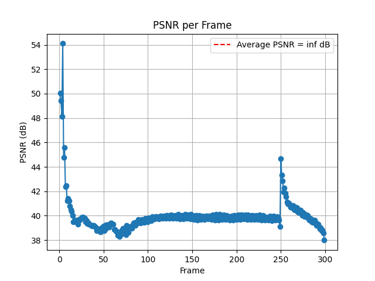
  * 0.1 vs 0.2
    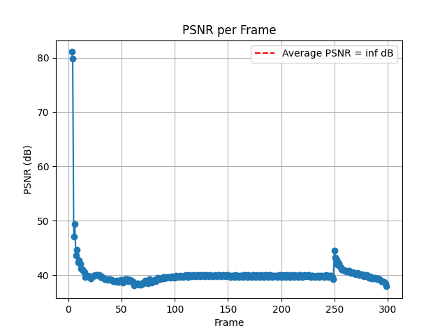

#### sand

| 0.0                                                                                                                                                        | 0.1 (baseline)                                                                                                                                             | 0.2                                                                                                                                                        |
| ---------------------------------------------------------------------------------------------------------------------------------------------------------- | ---------------------------------------------------------------------------------------------------------------------------------------------------------- | ---------------------------------------------------------------------------------------------------------------------------------------------------------- |
| <video src="https://github.com/user-attachments/assets/3652de48-8050-41c7-8ce8-c6d77c13f9f1" width="320" autoplay muted loop playsinline controls></video> | <video src="https://github.com/user-attachments/assets/9e393556-fe18-40db-98ce-88528893b032" width="320" autoplay muted loop playsinline controls></video> | <video src="https://github.com/user-attachments/assets/1f11bb22-c4bd-4eac-a95e-e81d6096dfdc" width="320" autoplay muted loop playsinline controls></video> |

* PSNR

  * 0.1 vs 0.0
    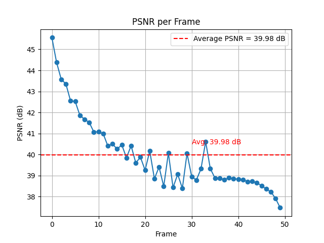
  * 0.1 vs 0.2
    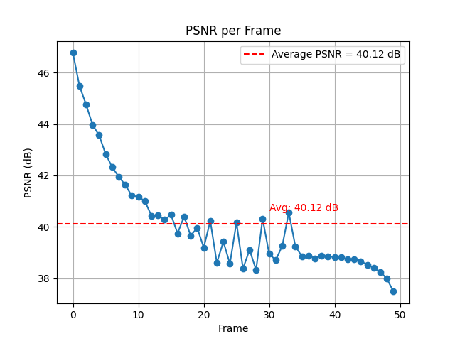

### observed

Softening typically controls the stiffness of the material. A higher value results in softer materials and more noticeable deformation. However, the simulation results show minimal differences when adjusting this parameter. Upon reviewing the code, it was discovered that softening only affects materials set to "plasticine." Therefore, additional simulations were conducted with the following modifications:

in `pillow2sofa_config.json`

```json
"material": "plasticine",
"yield_stress": 0.5,
```

and the result:

| softening = 0.0 | softening = 0.1 | softening = 0.2 |
|-----------------|-----------------|-----------------|
| <video src="https://github.com/user-attachments/assets/9b41aa9b-722b-4db6-85f4-ef3f5c76e128" width="320" autoplay muted loop playsinline controls></video> | <video src="https://github.com/user-attachments/assets/116b3bfb-45bf-4634-acd6-54b5d6f8844e" width="320" autoplay muted loop playsinline controls></video> | <video src="https://github.com/user-attachments/assets/bcc58f39-98e2-4184-8a86-e2519fba65e0" width="320" autoplay muted loop playsinline controls></video> |

We can discover that softening effectively controls the stiffness of the material. Higher values result in softer materials and more pronounced deformation.

## BONUS
We utilize multi-view images to segment different parts of the object using SAM, followed by a VLM-based inference to automatically identify the material and physical properties of each segmented part.

# Reference
```bibtex
@inproceedings{xie2024physgaussian,
    title     = {Physgaussian: Physics-integrated 3d gaussians for generative dynamics},
    author    = {Xie, Tianyi and Zong, Zeshun and Qiu, Yuxing and Li, Xuan and Feng, Yutao and Yang, Yin and Jiang, Chenfanfu},
    booktitle = {Proceedings of the IEEE/CVF Conference on Computer Vision and Pattern Recognition},
    year      = {2024}
}
```
